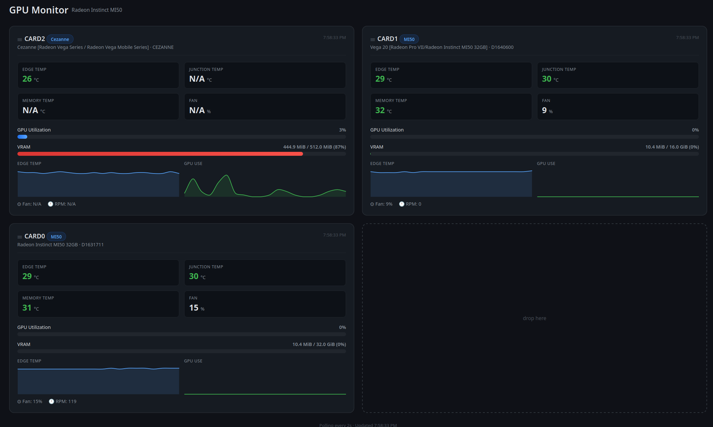

# Radeon Instinct MI50 Monitor

Real-time web dashboard for monitoring AMD Radeon Instinct MI50 GPUs (and any other AMD GPU detected by ROCm). Displays temperature, VRAM usage, utilization, fan speed, and live graphs.



## Features

- **Per-GPU cards** — one card per detected GPU, automatically adapts to any number of cards (no hardcoded limits)
- **Temperatures** — edge, junction, and memory sensors with color coding (green < 65°C, yellow < 85°C, red ≥ 85°C)
- **Graphs** — live line charts for edge temperature and GPU utilization (last ~2 minutes)
- **VRAM** — used/total with color gradient based on fullness
- **Utilization** — current GPU busy percentage with progress bar
- **Fan speed** — percentage and RPM where supported
- **Drag-and-drop layout** — arrange cards freely in a 2-column grid like a chessboard; empty cells are valid drop targets, dropping on an occupied cell swaps cards, layout persists across reloads
- **Auto-refresh** — polls every 2 seconds

## Requirements

- Linux system with AMD GPUs (e.g. Radeon Instinct MI50) and the `amdgpu` kernel driver
- ROCm SMI (`rocm-smi` on PATH, provided by the `rocm-smi-lib` / ROCm toolchain)
- Python 3.10+
- `rocm-smi` must output the `--json` flag

## Installation

```bash
cd mi50_monitoring

# Create and activate a virtual environment
python3 -m venv venv
source venv/bin/activate

# Install Python dependencies
pip install -r requirements.txt
```

## Usage

Start the server:

```bash
./run.sh
```

Or manually:

```bash
source venv/bin/activate
uvicorn app:app --host 0.0.0.0 --port 8900
```

Then open [http://localhost:8900](http://localhost:8900) in your browser.

> The port is `8900` by default. Change it in `run.sh` or pass a different value to `uvicorn` if needed.

## Project Structure

```
mi50_monitoring/
├── app.py               # FastAPI application + rocm-smi polling
├── templates/
│   └── index.html       # Dashboard UI (Chart.js, drag-and-drop grid)
├── requirements.txt     # Python dependencies
├── run.sh               # Convenience launcher
└── doc/
    └── radeon-monitoring.png  # Screenshot
```

## API

### `GET /` — Dashboard

Serves the monitoring web page.

### `GET /api/gpus` — GPU data (JSON)

Returns current metrics and history for every detected GPU:

```json
{
  "id": "card0",
  "name": "Radeon Instinct MI50 32GB",
  "temp_edge": 56.0,
  "temp_junction": 57.0,
  "temp_memory": 57.0,
  "fan_speed": 17.0,
  "fan_rpm": 15,
  "gpu_use": 0.0,
  "vram_total": 34342961152,
  "vram_used": 10993664,
  "history": {
    "temp_edge": [{"t": "2026-09-19T12:00:00", "v": 56.0}],
    "gpu_use":   [{"t": "2026-09-19T12:00:00", "v": 0.0}]
  }
}
```

Units: temperatures in °C, VRAM in bytes, utilization in percent, history capped at the last 60 samples.

## Notes

- Data is fetched via the system `rocm-smi --json` command.
- Power values are not displayed because the MI50 often reports `N/A` for `get_power_avg`; the data model skips unsupported metrics gracefully.
- Non-MI50 AMD GPUs (e.g. an integrated APU) are shown as well — useful to glance at the whole system.